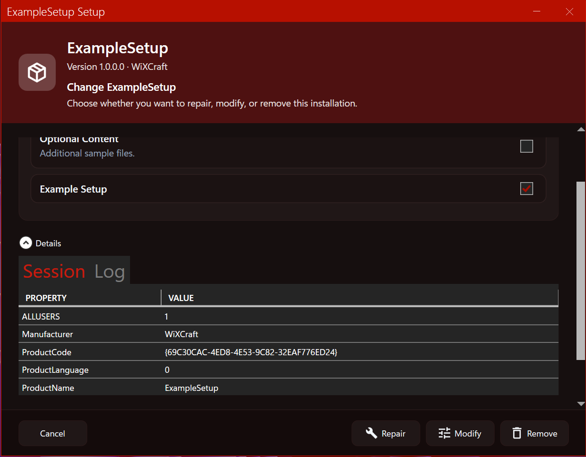

# WiXCraft

WiXCraft is a small toolkit for building **custom WPF embedded UI** installers with [WiX Toolset v5](https://wixtoolset.org/). It replaces the boilerplate normally required to implement `IEmbeddedUI`, wire up MSI message handling, progress tracking, maintenance-mode flows, and install cancellation.

The repository contains the WiXCraft libraries, MSBuild integration, and a working sample (`ExampleInterface` + `ExampleSetup`).



## What you get

- **MSBuild packages** that generate WiX include files and embed your UI assembly into the MSI
- **`WiXCraft.Core`** — embedded UI engine (`Initialize`, block until the user starts install, progress, cancel coordination)
- **`WiXCraft.CustomActions`** — deferred custom action that honors user cancellation from the embedded UI
- **`ExampleInterface`** — reference WPF installer (MVVM, MahApps.Metro, maintenance/repair/modify/remove, feature selection, live install action text, animated finish state)
- **`ExampleSetup`** — sample WiX v5 package that produces an MSI using the embedded UI

## Repository layout

```
src/
  WiXCraft.slnx              Solution entry point
  WiXCraft.Core/             Core embedded UI engine (NuGet: WiXCraft.Core)
  WiXCraft.Installer/        WiX MSBuild integration (NuGet: WiXCraft.Installer)
  WiXCraft.Installer.Wpf/    WPF embedded UI entry point + props/targets
  WiXCraft.CustomActions/    Cancellation custom action DLL
  ExampleInterface/          Sample WPF embedded UI project
  ExampleSetup/              Sample WiX installer (.msi)
  Directory.Build.props      Shared versions + development-mode defaults
```

## Prerequisites

- Windows
- [.NET Framework 4.8 SDK](https://dotnet.microsoft.com/download/dotnet-framework)
- [.NET SDK](https://dotnet.microsoft.com/download) (for `dotnet build`)
- [WiX Toolset v5](https://wixtoolset.org/docs/intro/) (pulled in via `WixToolset.Sdk` for the sample)

Embedded UI runs as **x86** under `msiexec`, matching the platform WiXCraft targets.

## Build the sample MSI

From the repository root:

```powershell
dotnet build src\WiXCraft.slnx
```

The MSI is written to:

```
src\ExampleSetup\bin\x64\Debug\ExampleSetup.msi
```

Run it directly or install with:

```powershell
msiexec /i src\ExampleSetup\bin\x64\Debug\ExampleSetup.msi
```

To exercise maintenance mode, install once, then run the MSI again or use **Apps & features → Modify**.

## How it works

1. **`ExampleSetup`** sets `UseWiXCraftInstaller=true` and references `ExampleInterface`. Before build, WiXCraft generates `WiXCraft.generated.wxi` with embedded UI binary entries and cancellation custom action wiring.
2. **`ExampleInterface`** is a WPF class library (`net48`, `x86`) with:
   - `UseWiXCraftEmbeddedUi=true` / `UseWiXCraftEmbeddedUiWpf=true`
   - `EmbeddedUiHostFactory` pointing at your `IInstallerUiHostFactory` implementation
3. At install time, MSI loads the embedded UI DLL. **`EmbeddedUiEntryPoint`** (from `WiXCraft.Installer.Wpf`) delegates to your host factory.
4. Your **`IInstallerUiHost`** runs a WPF `Application`, shows your window, and blocks MSI until the user chooses an action (install, repair, modify, remove).
5. **`IInstallerUiContext`** exposes session properties, features, progress, and MSI message handling so your view models stay focused on UI logic.

## Create your own embedded UI

### 1. WPF UI project

Create a `net48` WPF class library with platform `x86`:

```xml
<PropertyGroup>
  <TargetFramework>net48</TargetFramework>
  <UseWPF>true</UseWPF>
  <PlatformTarget>x86</PlatformTarget>
  <UseWiXCraftEmbeddedUi>true</UseWiXCraftEmbeddedUi>
  <UseWiXCraftEmbeddedUiWpf>true</UseWiXCraftEmbeddedUiWpf>
  <EmbeddedUiHostFactory>YourAssembly!YourNamespace.YourInstallerUiHostFactory</EmbeddedUiHostFactory>
</PropertyGroup>

<ItemGroup>
  <PackageReference Include="WiXCraft.Installer.Wpf" Version="1.0.0" />
</ItemGroup>
```

Implement:

- `IInstallerUiHostFactory` → returns your `IInstallerUiHost`
- `IInstallerUiHost` → run WPF, forward `ProcessMessage` / `EnableExit` to your UI

See `ExampleInterface` for a full pattern with dependency injection, MVVM, and views.

### 2. WiX installer project

```xml
<PropertyGroup>
  <UseWiXCraftInstaller>true</UseWiXCraftInstaller>
  <WiXCraftIncludeEmbeddedUi>true</WiXCraftIncludeEmbeddedUi>
</PropertyGroup>

<ItemGroup>
  <ProjectReference Include="..\YourUiProject\YourUiProject.csproj" />
  <ProjectReference Include="..\WiXCraft.CustomActions\WiXCraft.CustomActions.csproj" />
  <PackageReference Include="WiXCraft.Installer" Version="1.0.0" />
</ItemGroup>
```

In `Product.wxs` (or equivalent):

```xml
<?include WiXCraft.generated.wxi ?>
```

## Development mode

`src\Directory.Build.props` sets `WiXCraftDevelopmentMode=true` by default. In this mode the solution builds against **project references** instead of NuGet packages, so you can iterate on WiXCraft and the sample together.

Set `WiXCraftDevelopmentMode=false` (and pack/publish the WiXCraft packages) to consume WiXCraft as NuGet packages like a downstream project would.

## NuGet packages

| Package | Purpose |
|---------|---------|
| `WiXCraft.Core` | Embedded UI engine and installer context APIs |
| `WiXCraft.Installer` | MSBuild targets for WiX projects |
| `WiXCraft.Installer.Wpf` | WPF `IEmbeddedUI` entry point, config generation, Core reference |

Package versions are defined in `src\Directory.Build.props`.

## Sample UI highlights

`ExampleInterface` is intentionally polished to demonstrate what a production-style embedded UI can look like:

- Dark red MahApps.Metro theme with custom installer resources
- Windows 11 Mica and rounded window corners (when supported)
- Feature selection with maintenance flows (repair / modify / remove)
- Live **current action** text during install
- Animated success/failure finish screen
- Collapsible **Details** section (session properties + log) for diagnostics

## Notes

- Embedded UI must stay **x86** (`PlatformTarget`) for compatibility with WiX embedded UI hosting.
